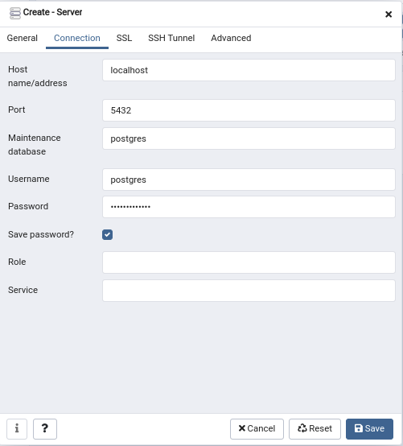
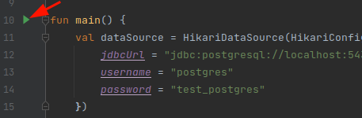

# 🇧🇷 Connection pool - Exemplos de estudo  sobre como funciona
[English version](#-connection-pool---study-examples-on-how-it-works)

Essa aplicação foi criada para exemplificar as funcionalidades de um _Connection Pool_ 
e também para mostrar que o Kotlin não se restringe a Mobile e pode ser usado no Backend.

[Nessa publicação](https://medium.com/creditas-tech/pool-de-conex%C3%B5es-com-spring-e-postgres-ded983543522) está a explicação detalhada do conceito.

## Pré requisitos:
- [Docker compose 1.25+](https://docs.docker.com/compose/install/)
- Java 8+
- [PG Admin 4](https://www.pgadmin.org/download/)

## Preparação do ambiente para execução dos exemplos

### Postgres
Para criar e iniciar o postgres, executar no terminal:
```bash
docker compose up
```
(Para versões mais antigas do docker compose usar:`docker-compose up`)

Para conectar no Postgres e visualizar as conexões:

Abrir o PG Admin e criar uma nova conexão com o servidor




Usar password `test_postgres`

### Kotlin
A maneira mais fácil de executar os exemplos é abrir com o IntelliJ e clicar em Run ao lado da função main.



Também é possível executar pelo terminal.
### Em Linux/Mac:
```shell
./gradlew run -PexampleToRun=NOME_DO_ARQUIVO
```
#### Exemplo:
```shell
./gradlew run -PexampleToRun=ConnectionPoolLimitTimeoutExample
```

### Em Windows:
```shell
gradlew.bat run -PexampleToRun=NOME_DO_ARQUIVO
```
#### Exemplo:
```shell
gradlew.bat run -PexampleToRun=ConnectionPoolLimitTimeoutExample
```

---

# 🇺🇸 Connection pool - Study examples on how it works
This application was created to exemplify the functionalities of a _Connection Pool_
and also to show that Kotlin can be used in the Backend.

Concept and the detailed explanation [in this post (Portuguese language)](https://medium.com/creditas-tech/pool-de-conex%C3%B5es-com-spring-e-postgres-ded983543522).

## Prerequisites:
- [Docker compose 1.25+](https://docs.docker.com/compose/install/)
- Java 8+
- [PG Admin 4](https://www.pgadmin.org/download/)

### Postgres
To create and start postgres, run in terminal:
```bash
docker compose up
```
(For older versions of docker compose: `docker-compose up`)

To connect to Postgres and view connections:

Open PG Admin and create a new server connection


Use password `test_postgres`

### Kotlin
The easiest way to run the examples is to open them with IntelliJ and click Run next to the main function.


You can also run it from the terminal.

### On Linux/Mac:
```shell
./gradlew run -PexampleToRun=NOME_DO_ARQUIVO
```
#### Exemple:
```shell
./gradlew run -PexampleToRun=ConnectionPoolLimitTimeoutExample
```

### On Windows:
```shell
gradlew.bat run -PexampleToRun=NOME_DO_ARQUIVO
```
#### Exemple:
```shell
gradlew.bat run -PexampleToRun=ConnectionPoolLimitTimeoutExample
```
